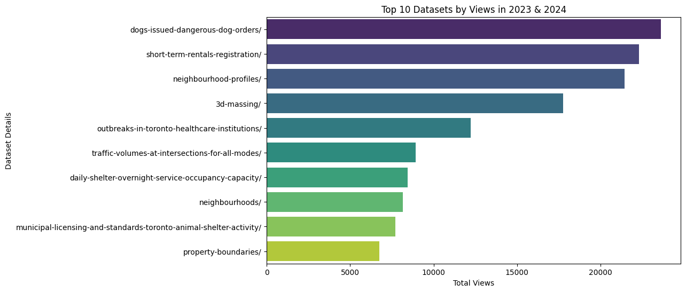
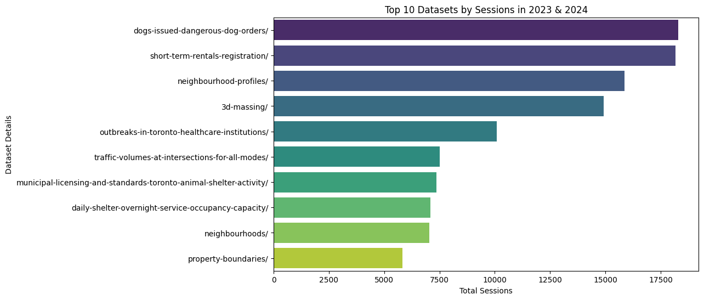
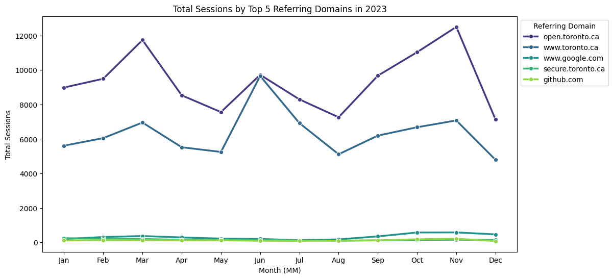
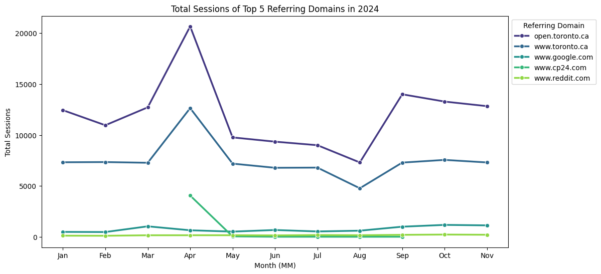

# Web Analytics for City of Toronto's Open Data Portal (2023 - 2024)
Analysis by: Jinesh Dutt, Rishabh Kaushick
<br>Supervised by: Dr. Omar Badreldin

## Aim
1. To analyze and visualize the existing data.
2. To identify external data sources to enhance existing visualizations.
3. To perform predictions on how the data may change over time.

## Visualizations
### Top Datasets by Views of All Time in 2023 & 2024

### Top Datasets by Sessions of All Time in 2023 & 2024

### Top Datasets by Users of All Time in 2023 & 2024

### Donut Chart of Top Sessions by URL Categories

### Top Referring Domain by Sessions in 2023

### Top Referring Domain by Sessions in 2024

### Word Cloud of Search Terms (2023 & 2024)


## Documentation
### Data Description

**Referrer Domains (od-referrer-domains-2023.csv)**
| Sr. No | Column Name      | Data Type |
|--------|------------------|-----------|
| 1      | Referring Domain | String    |
| 2      | Date             | Date      |
| 3      | Session          | Integer   |
| 4      | Users            | Integer   |
| 5      | Views            | Integer   |

**Search Terms**
| Sr. No | Column Name                      | Data Type |
|--------|----------------------------------|-----------|
| 1      | Search Term -Generic (search=)   | String    |
| 2      | Date                             | Date      |
| 3      | Views                            | Integer   |

**Usership Metrics**
...

### Data Cleaning
1. For each dataset - segregated summary rows & non summary rows into two different sheets.
2. Extracted the date:
   1. month, day and year: for easy future analysis with respect to date
   2. day of the week: for example Mon, Tue, Wed
   
3. In the user-ship metrics: Extracted details from 'Link Source Page URL' to understand the base url, which web page is visited, and if it a dataset - which dataset:

For example:
    | Link Source Page URL| Base URL | Category | Category Details 1 | Category Details 2 |
    |---------------------|----------|----------|--------------------|--------------------|
    | open.toronto.ca/dataset/central-intake-calls/{"csv":"77d6e185-90b2-48d0-94c5-e5cf68265c92" |  open.toronto.ca | dataset | central-intake-calls | {"csv":"77d6e185-90b2-48d0-94c5-e5cf68265c92" |
4. In the user-ship metrics: When the 'Link Source -Page URL' did not have category as 'dataset' or 'catalog' or anything specific - it often referred to blog posts. For example the below URL is a blog post:
    ```
    open.toronto.ca/decoding-transit-delays-a-data-driven-dive-into-the-toronto-transit-commission-2014-2022/ 
    ``` 
    Therefore we have updated the Link Source - URL Category to 'blog-post' from the previous value:
     ```
     decoding-transit-delays-a-data-driven-dive-into-the-toronto-transit-commission-2014-2022
     ```
    
